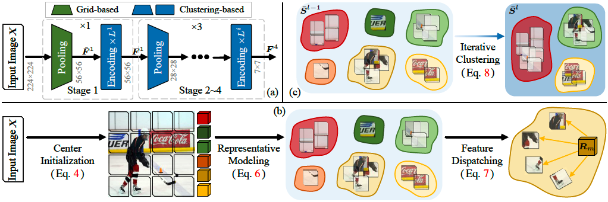

# Neural Clustering based Visual Representation Learning



>[Neural Clustering based Visual Representation Learning](https://arxiv.org/abs/2403.17409) <br>
>[Guikun Chen](https://scholar.google.com/citations?user=I1TOdpkAAAAJ), [Xia Li](https://xialipku.github.io/), [Yi Yang](https://scholar.google.com/citations?hl=zh-CN&user=RMSuNFwAAAAJ), [Wenguan Wang](https://sites.google.com/view/wenguanwang)
>

This is the official implementation of "Neural Clustering based Visual Representation Learning" (Accepted at CVPR 2024).

## Abstract

We investigate a fundamental aspect of machine vision: the measurement of features, by revisiting clustering, one of the most classic approaches in machine learning and data analysis. Existing visual feature extractors, including ConvNets, ViTs, and MLPs, represent an image as rectangular regions. Though prevalent, such a grid-style paradigm is built upon engineering practice and lacks explicit modeling of data distribution. In this work, we propose feature extraction with clustering (FEC), a conceptually elegant yet surprisingly *ad-hoc* interpretable neural clustering framework, which views feature extraction as a process of selecting representatives from data and thus automatically captures the underlying data distribution. Given an image, FEC alternates between grouping pixels into individual clusters to abstract representatives and updating the deep features of pixels with current representatives. Such an iterative working mechanism is implemented in the form of several neural layers and the final representatives can be used for downstream tasks. The cluster assignments across layers, which can be viewed and inspected by humans, make the forward process of FEC fully transparent and empower it with promising *ad-hoc* interpretability. Extensive experiments on various visual recognition models and tasks verify the effectiveness, generality, and interpretability of FEC. We expect this work will provoke a rethink of the current *de facto* grid-style paradigm.

## Image Classification
### 1. Requirements

```bash
conda create -n fec python=3.9
conda activate fec
conda install pytorch==1.12.1 torchvision==0.13.1 cudatoolkit=11.3 -c pytorch
pip install -r requirements.txt
pip install torch-scatter -f https://data.pyg.org/whl/torch-1.12.1+cu113.html
# optional, for seg and det only
mim install mmcv-full==1.6.0
pip install mmsegmentation==0.24.0 mmdet==2.24.0
```

### 2. Data 

ImageNet with the following folder structure, you can extract ImageNet by this [script](https://gist.github.com/BIGBALLON/8a71d225eff18d88e469e6ea9b39cef4).

```
│imagenet/
├──train/
│  ├── n01440764
│  │   ├── n01440764_10026.JPEG
│  │   ├── n01440764_10027.JPEG
│  │   ├── ......
│  ├── ......
├──val/
│  ├── n01440764
│  │   ├── ILSVRC2012_val_00000293.JPEG
│  │   ├── ILSVRC2012_val_00002138.JPEG
│  │   ├── ......
│  ├── ......
```

### 3. Scripts

**See folder [cmds](cmds/) for training, validation, and visualization.**

### 4. Checkpoints

We uploaded all the checkpoints to [GoogleDrive](https://drive.google.com/drive/folders/1X7MhOpg50d1aAmWOP9M7psBhW_fJzg2A?usp=sharing). Feel free to download.


**See folder [detection](detection/) for Detection and Instance Segmentation tasks on COCO.**

**See folder [segmentation](segmentation/) for Semantic Segmentation task on ADE20K.**

## Acknowledgment
Our implementation is mainly based on the following codebases. We gratefully thank the authors for their wonderful works.

[Context-Cluster](https://github.com/ma-xu/Context-Cluster), [poolformer](https://github.com/sail-sg/poolformer), [pytorch-image-models](https://github.com/rwightman/pytorch-image-models), [mmdetection](https://github.com/open-mmlab/mmdetection), [mmsegmentation](https://github.com/open-mmlab/mmsegmentation).


## Citation

If you find this work useful in your research, please star our repository and consider citing:

```
@inproceedings{chen2024neural,
  title={Neural Clustering based Visual Representation Learning},
  author={Chen, Guikun and Li, Xia and Yang, Yi and Wang, Wenguan},
  booktitle={CVPR},
  year={2024}
}
```

## Contact

Any comments, please email: guikunchen@gmail.com.
